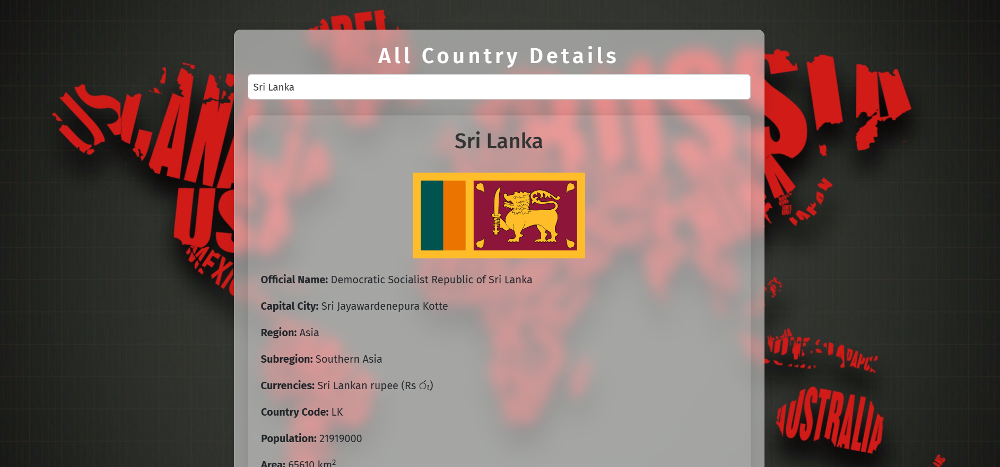

                    
# Country Information Finder 🌍

This web application allows users to select a country from a dropdown list and view detailed information about it, such as the country’s capital, population, area, and more. The app also displays the country's location on an interactive map.

## Features
- Fetches data from the [REST Countries API](https://restcountries.com) to provide details on countries.
- Displays information like official name, capital, region, population, area, and more.
- Integrates with Google Maps to show the selected country’s location on the map.
- Uses PHP and Bootstrap for a responsive and user-friendly interface.

## Setup and Installation
To set up this project locally, follow these steps:

### 1. Clone the Repository
```bash
git clone https://github.com/your-username/country-information-finder.git
cd country-information-finder
```

### 2. Install PHP (if not installed)
Make sure you have PHP installed. You can verify by running:
```bash
php -v
```

### 3. Set Up API Keys
1. Create a file called `config.php` in the root directory.
2. Add the following line with your Google Maps API key:
   ```php
   <?php
   define('GOOGLE_MAPS_API_KEY', 'YOUR_API_KEY_HERE');
   ```
3. Save `config.php`. **(Note: `config.php` is ignored in `.gitignore` to protect your API key)**.

### 4. Run the Application
1. Start a local PHP server:
   ```bash
   php -S localhost:8000
   ```
2. Open [http://localhost:8000](http://localhost:8000) in your browser.

### 5. Optional: Customize Configurations
If needed, modify `config.example.php` to add default values or placeholders, then copy it to `config.php` for secure API key management.

## Usage
1. Select a country from the dropdown list to view its details.
2. The app fetches data from the REST Countries API and displays it on the page.
3. The Google Map updates to show the country’s location, with a marker indicating the capital city.

## Technologies Used
- **PHP**: Backend logic and API requests.
- **Bootstrap**: Styling and responsiveness.
- **jQuery**: Dynamic content updates.
- **REST Countries API**: Provides country data.
- **Google Maps API**: Displays country locations on a map.

## Screenshots


## Contributing
Contributions are welcome! Please fork the repository and create a pull request for any improvements or bug fixes.

## License
This project is licensed under the MIT License.

---

**Note**: Replace `YOUR_API_KEY_HERE` with your actual Google Maps API key. If you’d like, you can add more details about the project’s functionality, such as screenshots or additional usage notes. Let me know if you need help with any adjustments!
